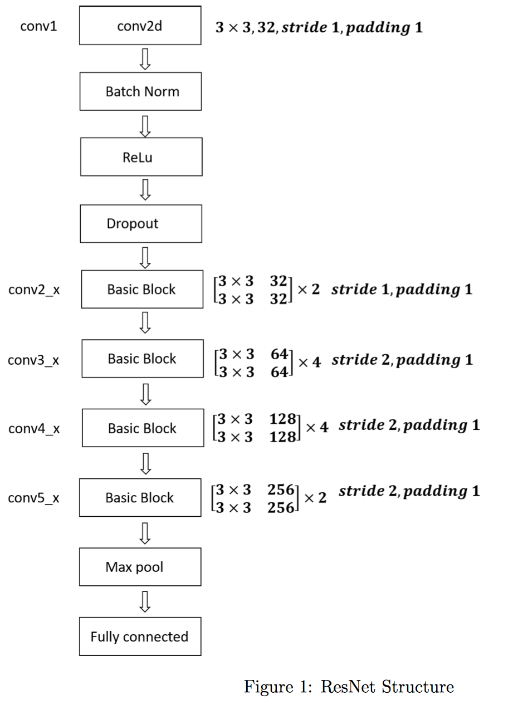
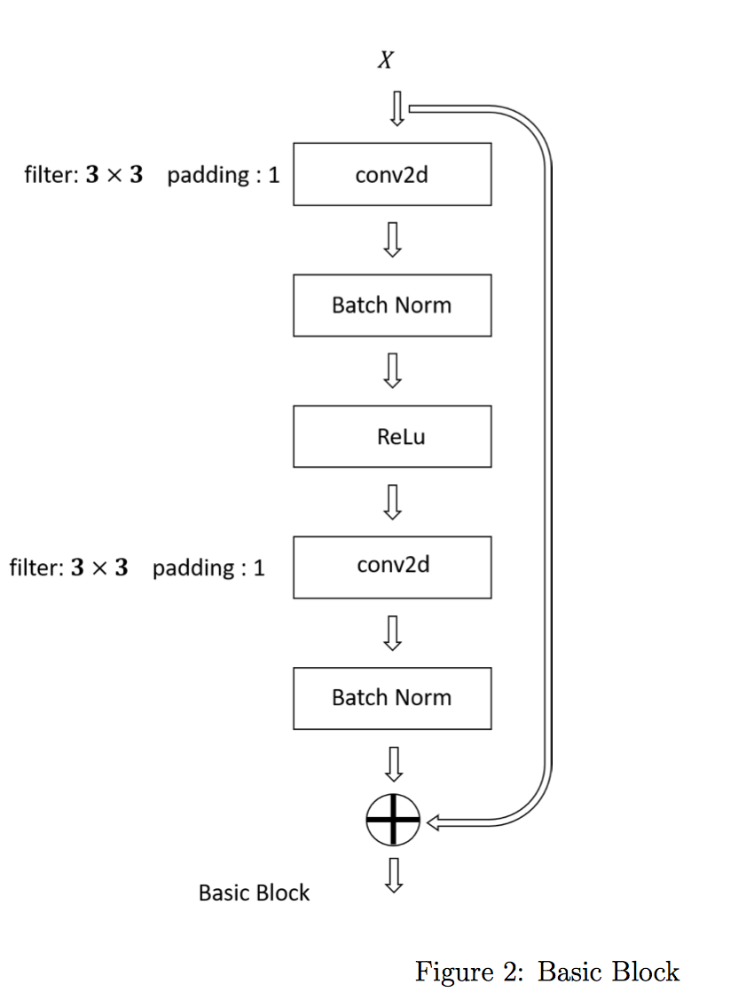

------
# Fall 2018 IE534/CS598:  HW4

**Name**: Ziyu Zhou, 
**NetID**: ziyuz2

------

> * Build the Residual Network specified in Figure 1 and achieve at least 60% test accuracy.
>
>   In the homework, you should define your “Basic Block” as shown in Figure 2. For each weight layer, it should contain 3 × 3 filters for a specific number of input channels and output channels. The output of a sequence of ResNet basic blocks goes through a max pooling layer with your own choice of filter size, and then goes to a fully-connected layer. The hyperparameter specification for each component is given in Figure 1. Note that the notation follows the notation in He et al. (2015).
>
> * Fine-tune a pre-trained ResNet-18 model and achieve at least 70% test accuracy.

<!-- TOC -->
**Table of Contents:**

- [Fall 2018 IE534/CS598:  HW4](#fall-2018-ie534cs598--hw4)
    - [Part I: Build the required Residual Network](#part-i-build-the-required-residual-network)
        - [Test accuracy](#test-accuracy)
        - [Hyperparameters](#hyperparameters)
        - [Model Architecture](#model-architecture)
    - [Part II: Fine-tune a pre-trained ResNet-18 model](#part-ii-fine-tune-a-pre-trained-resnet-18-model)
        - [Test accuracy](#test-accuracy-1)
        - [Hyperparameters](#hyperparameters-1)
    - [Usage](#usage)
        - [Run the program](#run-the-program)
        - [Configurations](#configurations)
    - [Implementation](#implementation)

<!-- /TOC -->


## Part I: Build the required Residual Network

### Test accuracy
**`61.48%`**.

See the following training and testing output

```
*** Performing data augmentation...
Files already downloaded and verified
Files already downloaded and verified
*** Initializing model...
*** Start training on device cuda...
* Hyperparameters: LR = 0.001, EPOCHS = 40, LR_SCHEDULE = True
Training [epoch: 1] loss: 3.887, accuracy: 0.10216
Testing [finished] accuracy: 0.12760
Training [epoch: 2] loss: 3.240, accuracy: 0.20704
Testing [finished] accuracy: 0.23670
Training [epoch: 3] loss: 2.820, accuracy: 0.28682
Testing [finished] accuracy: 0.30130
Training [epoch: 4] loss: 2.487, accuracy: 0.35552
Testing [finished] accuracy: 0.35130
Training [epoch: 5] loss: 2.232, accuracy: 0.40722
Testing [finished] accuracy: 0.39060
Training [epoch: 6] loss: 2.028, accuracy: 0.45362
Testing [finished] accuracy: 0.44400
Training [epoch: 7] loss: 1.864, accuracy: 0.49178
Testing [finished] accuracy: 0.48410
Training [epoch: 8] loss: 1.725, accuracy: 0.52784
Testing [finished] accuracy: 0.52110
Training [epoch: 9] loss: 1.606, accuracy: 0.55286
Testing [finished] accuracy: 0.53010
Training [epoch: 10] loss: 1.508, accuracy: 0.57756
Testing [finished] accuracy: 0.53540
Training [epoch: 11] loss: 1.422, accuracy: 0.59986
Testing [finished] accuracy: 0.53030
Training [epoch: 12] loss: 1.282, accuracy: 0.63182
Testing [finished] accuracy: 0.55450
Training [epoch: 13] loss: 1.210, accuracy: 0.65250
Testing [finished] accuracy: 0.56170
Training [epoch: 14] loss: 1.152, accuracy: 0.66568
Testing [finished] accuracy: 0.56840
Training [epoch: 15] loss: 1.087, accuracy: 0.68172
Testing [finished] accuracy: 0.57500
Training [epoch: 16] loss: 1.033, accuracy: 0.69594
Testing [finished] accuracy: 0.59370
Training [epoch: 17] loss: 0.977, accuracy: 0.71062
Testing [finished] accuracy: 0.59940
Training [epoch: 18] loss: 0.931, accuracy: 0.72260
Testing [finished] accuracy: 0.59560
Training [epoch: 19] loss: 0.875, accuracy: 0.73658
Testing [finished] accuracy: 0.59320
Training [epoch: 20] loss: 0.827, accuracy: 0.75032
Testing [finished] accuracy: 0.58610
Training [epoch: 21] loss: 0.782, accuracy: 0.76298
Testing [finished] accuracy: 0.59620
Training [epoch: 22] loss: 0.743, accuracy: 0.77368
Testing [finished] accuracy: 0.59490
Training [epoch: 23] loss: 0.707, accuracy: 0.78488
Testing [finished] accuracy: 0.58790
Training [epoch: 24] loss: 0.672, accuracy: 0.79278
Testing [finished] accuracy: 0.61240
Training [epoch: 25] loss: 0.639, accuracy: 0.79994
Testing [finished] accuracy: 0.61560
Training [epoch: 26] loss: 0.602, accuracy: 0.81288
Testing [finished] accuracy: 0.60910
Training [epoch: 27] loss: 0.579, accuracy: 0.81942
Testing [finished] accuracy: 0.59800
Training [epoch: 28] loss: 0.550, accuracy: 0.82604
Testing [finished] accuracy: 0.60460
Training [epoch: 29] loss: 0.519, accuracy: 0.83516
Testing [finished] accuracy: 0.60680
Training [epoch: 30] loss: 0.500, accuracy: 0.84144
Testing [finished] accuracy: 0.60710
Training [epoch: 31] loss: 0.471, accuracy: 0.85002
Testing [finished] accuracy: 0.61190
Training [epoch: 32] loss: 0.455, accuracy: 0.85428
Testing [finished] accuracy: 0.61120
Training [epoch: 33] loss: 0.429, accuracy: 0.86328
Testing [finished] accuracy: 0.60360
Training [epoch: 34] loss: 0.409, accuracy: 0.86912
Testing [finished] accuracy: 0.61190
Training [epoch: 35] loss: 0.395, accuracy: 0.87254
Testing [finished] accuracy: 0.61260
Training [epoch: 36] loss: 0.386, accuracy: 0.87428
Testing [finished] accuracy: 0.61280
Training [epoch: 37] loss: 0.368, accuracy: 0.88062
Testing [finished] accuracy: 0.60470
Training [epoch: 38] loss: 0.344, accuracy: 0.88960
Testing [finished] accuracy: 0.60420
Training [epoch: 39] loss: 0.335, accuracy: 0.89062
Testing [finished] accuracy: 0.61220
Training [epoch: 40] loss: 0.328, accuracy: 0.89328
Testing [finished] accuracy: 0.61480
Training [finished]
*** Start testing...
Testing [finished] accuracy: 0.61480
*** Congratulations! You've got an amazing model now :)
```

### Hyperparameters

* Optimizer: Adam
* Learning rate: start with 0.001 and multiplied by 0.1 every 15 epochs using the `StepLR` scheduler
* Batch_size: 128
* Dropout: 0.5
* Training Data Augmentation: `RandomCrop` with padding = 4, `RanomHorizontalFlip` and `Normalize`
* MaxPool: Kernel size = 4, stride = 1, padding = 0.


### Model Architecture

Built exactly according to the HW requirements:





## Part II: Fine-tune a pre-trained ResNet-18 model

### Test accuracy
**`72.03%`**.

See the following training and testing output

```
*** Performing data augmentation...
Files already downloaded and verified
Files already downloaded and verified
*** Initializing pre-trained model...
*** Start training on device cuda...
* Hyperparameters: LR = 0.001, EPOCHS = 10, LR_SCHEDULE = True
Training [epoch: 1] loss: 1.748, accuracy: 0.51720
Testing [finished] accuracy: 0.58120
Training [epoch: 2] loss: 1.077, accuracy: 0.68164
Testing [finished] accuracy: 0.64220
Training [epoch: 3] loss: 0.828, accuracy: 0.74998
Testing [finished] accuracy: 0.68730
Training [epoch: 4] loss: 0.667, accuracy: 0.79380
Testing [finished] accuracy: 0.69840
Training [epoch: 5] loss: 0.540, accuracy: 0.83136
Testing [finished] accuracy: 0.71700
Training [epoch: 6] loss: 0.441, accuracy: 0.85970
Testing [finished] accuracy: 0.72000
Training [epoch: 7] loss: 0.362, accuracy: 0.88270
Testing [finished] accuracy: 0.71870
Training [epoch: 8] loss: 0.306, accuracy: 0.90268
Testing [finished] accuracy: 0.71210
Training [epoch: 9] loss: 0.255, accuracy: 0.91652
Testing [finished] accuracy: 0.72120
Training [epoch: 10] loss: 0.212, accuracy: 0.93068
Testing [finished] accuracy: 0.72030
Training [finished]
*** Start testing...
Testing [finished] accuracy: 0.72030
*** Congratulations! You've got an amazing model now :)
```


### Hyperparameters

Same as Part I, except that the images are resized using `Resize(224)`, and the last fully connected layer is replaced using the following code:

```python
in_features = resnet.fc.in_features
resnet.fc = nn.Linear(in_features, 100)
```


## Usage

### Run the program

To train the customized ResNet model built in *Part I*, run

```
python3 main.py
```

To fine tune the pretrained model in *Part II*, run

```
python3 main.py --fine_tune True
```


### Configurations

Type `python3 main.py --help` to see the available configuration flags, like so

```
$ python3 main.py --help
usage: main.py [-h] [--fine_tune FINE_TUNE] [--lr LR] [--epochs EPOCHS]
               [--lr_schedule LR_SCHEDULE] [--load_checkpoint LOAD_CHECKPOINT]
               [--show_sample_image SHOW_SAMPLE_IMAGE] [--debug DEBUG]
               [--data_path DATA_PATH]

Training ResNet on CIFAR100

optional arguments:
  -h, --help            show this help message andexit
  --fine_tune FINE_TUNE
                        fine-tune pretrained model
  --lr LR               learning rate
  --epochs EPOCHS       number of training epochs
  --lr_schedule LR_SCHEDULE
                        perform lr shceduling
  --load_checkpoint LOAD_CHECKPOINT
                        resume from checkpoint
  --show_sample_image SHOW_SAMPLE_IMAGE
                        display data insights
  --debug DEBUG         using debug mode
  --data_path DATA_PATH
                        path to store data
```


## Implementation

See the file structure:

```
.
├── README.md
├── data_tools.py
├── fine_tune.py
├── layer.py
├── main.py
├── model.py
├── test.py
├── train.py
└── utils.py
```

When you run the program, you will get a `data` folder storing the CIFAR100 dataset. After training, you can find your model checkpoint at `checkpoints/model_state.pt`.