------
# Fall 2018 IE534/CS598:  HW5

**Author**: Ziyu Zhou

------


## Test Accuracy

57.460%

## Implementation

### Model Architecture

Use pretrained **ResNet50** model as the identical networks (Q,P,N). The model is fine tuned to extract feature embedding from the training images.

### Hyperparameters

- Optimizer: SGD (lr=0.001, momentum=0.9)
- Learning rate: start with 0.001 and multiplied by 0.01 every 10 epochs using the `StepLR` scheduler
- Number of epochs: 20
- Feature embedding dimension: 4096
- Batch size: 16 
- Training Data Augmentation: `Resize` the images to 224 x 224, `RandomCrop` with padding = 4, `RanomHorizontalFlip` and `Normalize` 

### File Structure

```

├── README.md
├── data
├── dataset.py		# Load dataset and perform online triplet sampling
├── evaluate.py		# Calculate training and test accuracies, perform query
├── main.py			# Main file to execute to train the model
├── plots.py		# Plot loss and query results
├── train.py		# 
├── utils.py
```


<div style="page-break-after: always;"></div>
## Quantitative results

> Quantitative results
>
> * Show a plot of your training loss
> * Include a table of similarity precision for both your training and test
>   * The percentage of triplets being correctly ranked

### Training loss

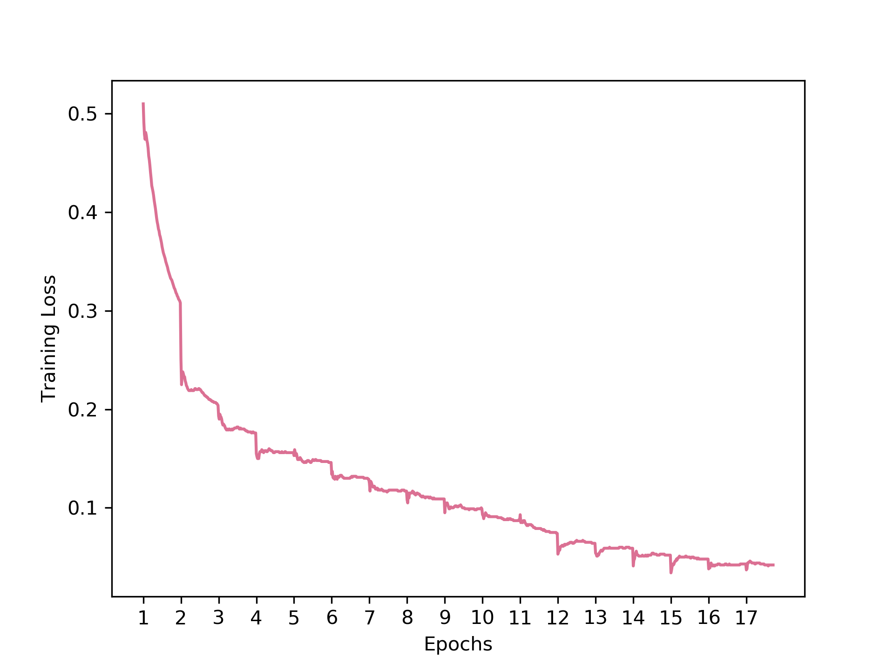

### Similarity precision

|                      | Training | Test    |
| -------------------- | -------- | ------- |
| Similarity precision | 64.862%  | 57.460% |


<div style="page-break-after: always;"></div>
## Sampling

> Sample 5 different images from the validation set (each from a different class)
>
> * Show the top 10 ranked results from your pipeline.
> * Show the euclidean distance of the ranked results from the query image
> * Show the bottom 10 ranked results (along with their euclidean distance)


### Sample #1

The first image (top left) is the query image. The text on top of each image contains its class and euclidean distance from the query image. This applies to all the following plots.

#### Top 10

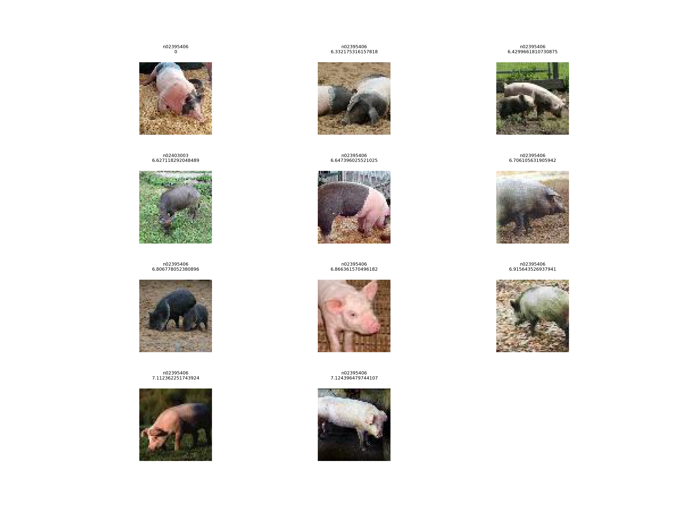

<div style="page-break-after: always;"></div>
#### Bottom 10

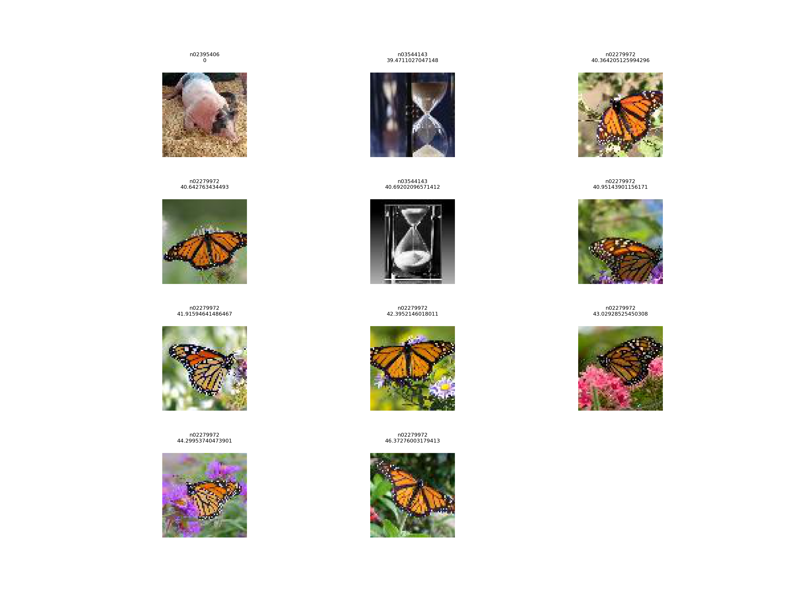


<div style="page-break-after: always;"></div>
### Sample #2

#### Top 10

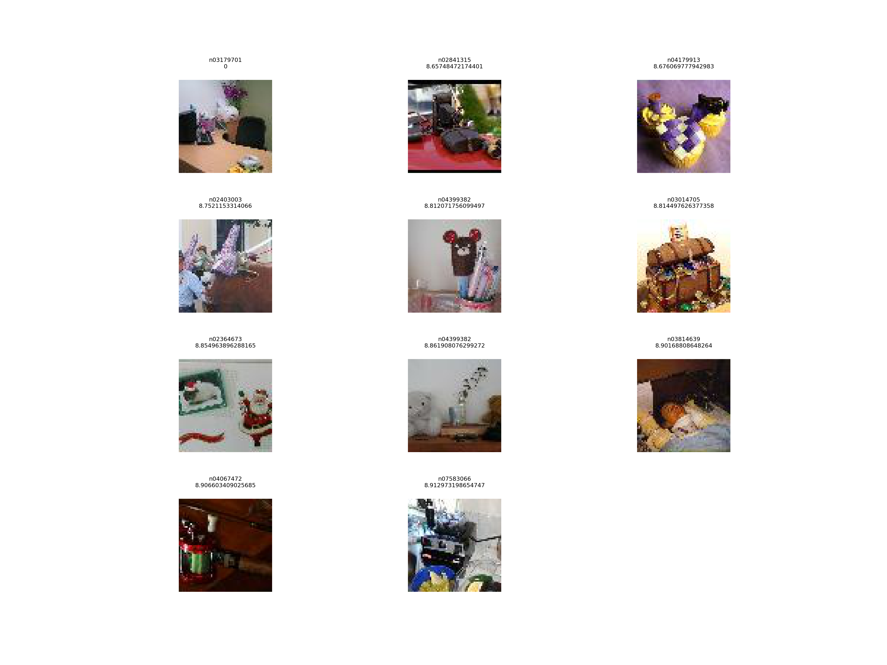

<div style="page-break-after: always;"></div>
#### Bottom 10

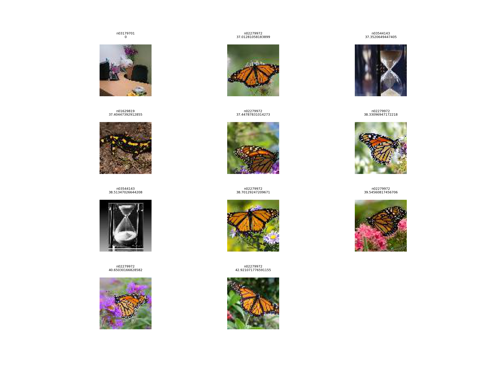


<div style="page-break-after: always;"></div>
### Sample #3

#### Top 10

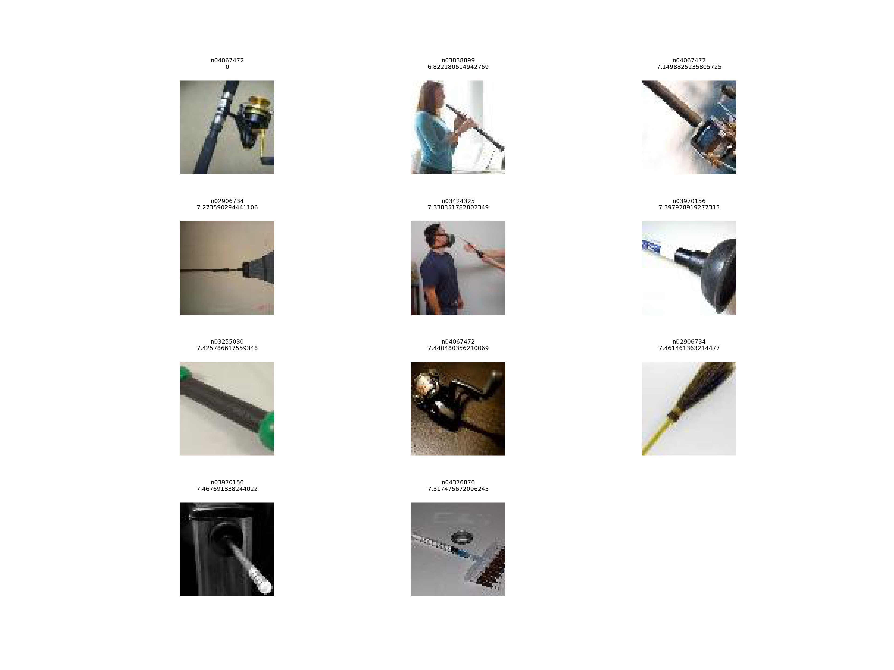

<div style="page-break-after: always;"></div>
#### Bottom 10

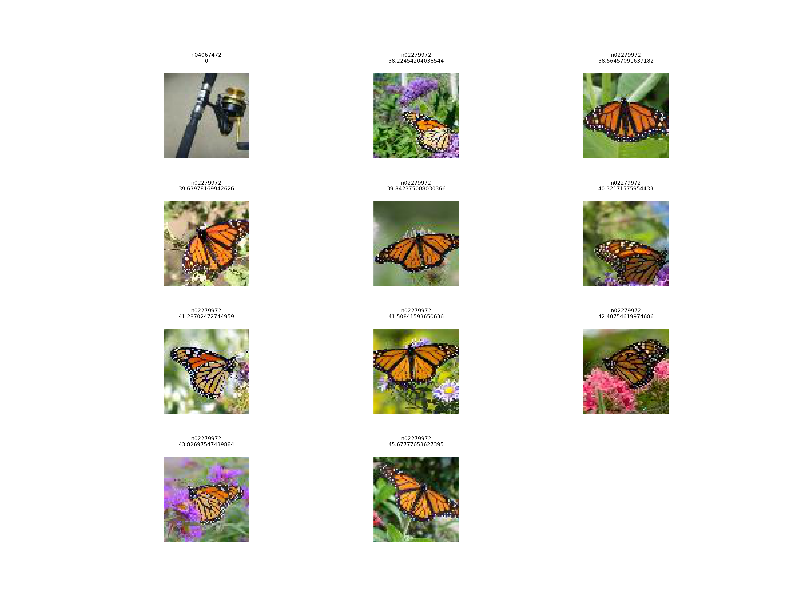

<div style="page-break-after: always;"></div>
### Sample #4

#### Top 10

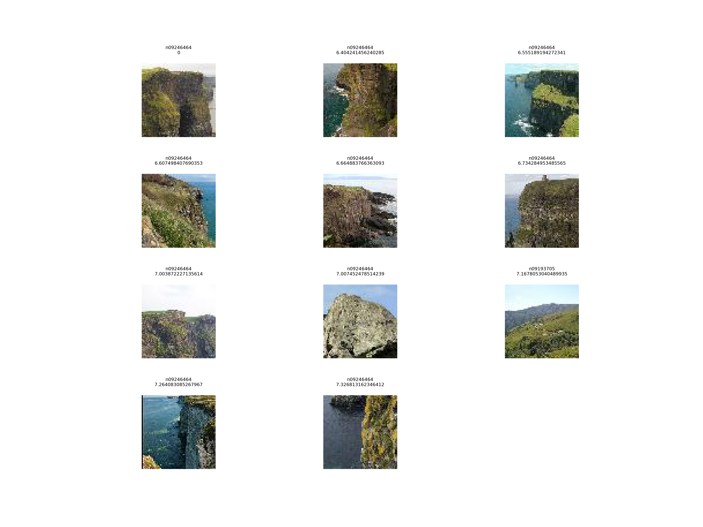

<div style="page-break-after: always;"></div>
#### Bottom 10

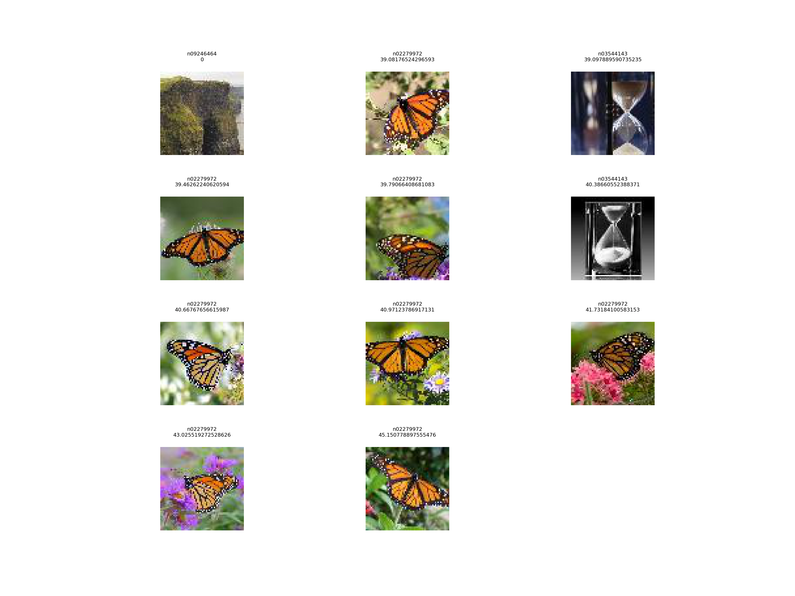

<div style="page-break-after: always;"></div>
### Sample #5

#### Top 10

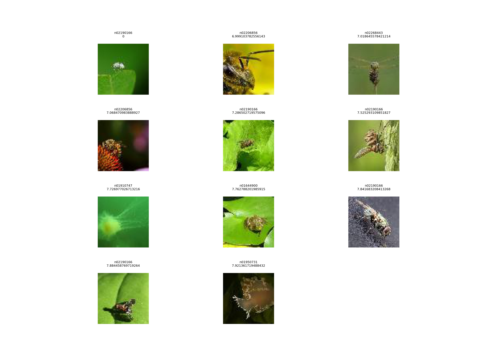

<div style="page-break-after: always;"></div>
#### Bottom 10

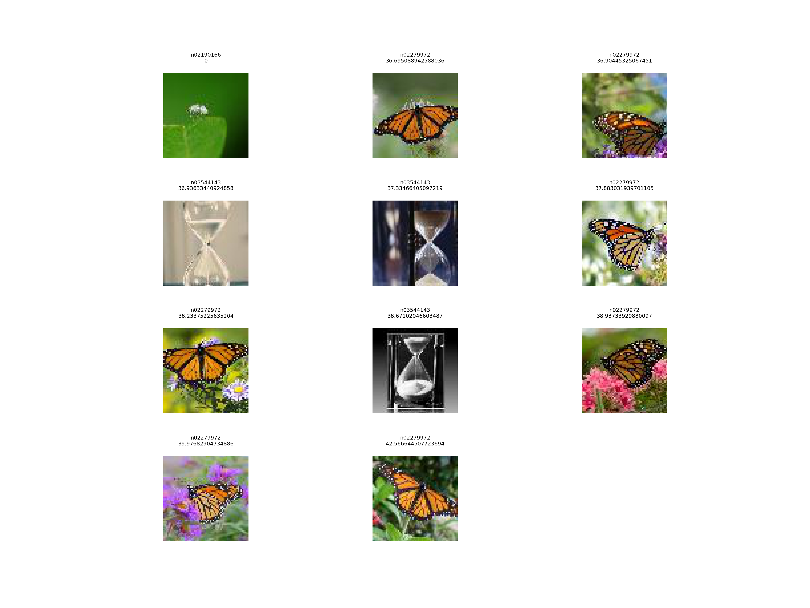

<div style="page-break-after: always;"></div>
## How to Improve the performance

> Describe at least one way in how you can improve the performance of your network

Use weighted sampling instead of uniform sampling for triplet sampling. Uniform sampling is sub-optimal because it doesn't consider the relevance among images. Weighted sampling can help select the most important triplets by computing a weighted relevance score for each image such that positive images with high relevance scores will be chosen at a higher probability. 

<div style="page-break-after: always;"></div>
## Usage

1. Train the model

   ```
   python3 main.py
   ```

   Arguments:

   ```
   $ python3 main.py --help
   usage: main.py [-h] [--lr LR] [--epochs EPOCHS] [--batch_size BATCH_SIZE]
                  [--feature_embedding FEATURE_EMBEDDING] [--model MODEL]
                  [--lr_schedule LR_SCHEDULE] [--load_checkpoint LOAD_CHECKPOINT]
                  [--show_sample_image SHOW_SAMPLE_IMAGE] [--debug DEBUG]
   
   Image Ranking
   
   optional arguments:
     -h, --help            show this help message and exit
     --lr LR               learning rate
     --epochs EPOCHS       number of training epochs
     --batch_size BATCH_SIZE
                           batch size
     --feature_embedding FEATURE_EMBEDDING
                           dimension of embedded feature
     --model MODEL         name of the chosen ResNet model
     --lr_schedule LR_SCHEDULE
                           perform lr shceduling
     --load_checkpoint LOAD_CHECKPOINT
                           resume from checkpoint
     --show_sample_image SHOW_SAMPLE_IMAGE
                           display data insights
     --debug DEBUG         using debug mode
   ```

2. Evaluate the trained model

   * Calculate training and testing accuracies:

     ```
     python3 evaluate.py 
     ```

   * Perform query by sampling 5 different images from the validation set:

     ```
     python3 evaluate.py --evaluate False --query True
     ```

   Arugments:

   ```
   $ python3 evaluate.py --help
   usage: evaluate.py [-h] [--batch_size BATCH_SIZE] [--model MODEL]
                      [--evaluate EVALUATE] [--query QUERY]
   
   Evaluate the trained model
   
   optional arguments:
     -h, --help            show this help message and exit
     --batch_size BATCH_SIZE
                           batch size for loading images
     --model MODEL         name of the trained ResNet model
     --evaluate EVALUATE   evaluate training and validation loss
     --query QUERY         perform query on 5 random images
   ```

3. Plot the results

   * Plot loss:

     ```
     python3 plots.py --path PATH
     ```

   * Plot images obtained from query:

     ```
     python3 plots.py --plot_type query_result
     ```

   Arguments:

   ```
   $ python3 plots.py --help
   usage: plots.py [-h] [--plot_type [{loss,query_result}]] [--path PATH]
   
   Generate plots
   
   optional arguments:
     -h, --help            show this help message and exit
     --plot_type [{loss,query_result}]
                           type of the plot to generate
     --path PATH           path of data file from which to generate the plot
   ```


